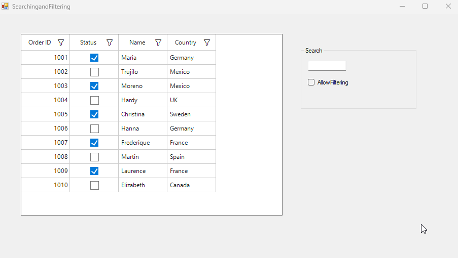

# How to avoid searching and Filtering in the CheckBoxColumn in WinForms SfDataGrid

In [Winforms DataGrid](https://www.syncfusion.com/winforms-ui-controls/datagrid){target="_blank"}, avoiding search and filtering based on checkbox column values can be achieved by specifying which columns should be included in search and filtering using the [SearchColumns](https://help.syncfusion.com/cr/windowsforms/Syncfusion.WinForms.DataGrid.SearchController.html#Syncfusion_WinForms_DataGrid_SearchController_SearchColumns) collection.

Additionally, a custom SearchHelperExt class can be created and override the FilterRecords method. Within this method, columns that are not part of the SearchColumns collection can be excluded from filtering.
 
 ```csharp
 this.sfDataGrid.SearchController = new SearchHelperExt(this.sfDataGrid);

 // Include the columns that need to search and filter.
 this.sfDataGrid.SearchController.SearchColumns.Add("OrderID");
 this.sfDataGrid.SearchController.SearchColumns.Add("CustomerID");
 this.sfDataGrid.SearchController.SearchColumns.Add("CustomerName");
 this.sfDataGrid.SearchController.SearchColumns.Add("Country");
 this.sfDataGrid.SearchController.SearchColumns.Add("ShipCity");

 public class SearchHelperExt : SearchController
 {
     private SfDataGrid sfDataGrid;
     public SearchHelperExt(SfDataGrid datagrid)
         : base(datagrid)
     {
         this.sfDataGrid = datagrid;
     }

     protected override bool FilterRecords(object dataRow)
     {
         if (string.IsNullOrEmpty(SearchText))
             return true;
         if (sfDataGrid != null && sfDataGrid.View != null && sfDataGrid.TableControl != null && sfDataGrid.Columns != null)
         {
             if (this.Provider == null)
                 Provider = this.sfDataGrid.View.GetPropertyAccessProvider();
             int columnIndex = this.sfDataGrid.TableControl.ResolveToGridVisibleColumnIndex(this.GetFirstColumnIndex(this.sfDataGrid, true));
             for (int i = columnIndex; i < this.sfDataGrid.Columns.Count; i++)
             {
                 var column = this.sfDataGrid.Columns[i];
                 // Skip columns not in SearchColumns
                 if (column == null || (SearchColumns.Count > 0 && !SearchColumns.Contains(column.MappingName)))
                     continue;
                 if (column.ActualWidth != 0.0 && column.Visible)
                 {
                     if (MatchSearchText(column, dataRow))
                         return true;
                 }
             }
         }   
         return false;
     }

    private int GetFirstColumnIndex(SfDataGrid dataGrid, bool isSearching = false)
    {
     int firstIndex = dataGrid.Columns.IndexOf(dataGrid.Columns.FirstOrDefault(x => x.Visible && x.Width != 0d && (x.AllowFocus || isSearching)));
     if (firstIndex < 0)
         return firstIndex;
     firstIndex += dataGrid.View != null ? dataGrid.View.GroupDescriptions.Count : 0;
     if (dataGrid.ShowPreviewRow) firstIndex += 1;
     if (dataGrid.ShowRowHeader)
         firstIndex += 1;
     return firstIndex;
    }
 } 
 ```


Take a moment to peruse the [Winforms DataGrid - Search](https://help.syncfusion.com/windowsforms/datagrid/search) documentation, where you can find about Searching and Filtering with code examples.

[View sample in the GitHub](https://github.com/SyncfusionExamples/How-to-avoid-searching-and-Filtering-in-the-CheckBoxColumn-in-WinForms-SfDataGrid)
